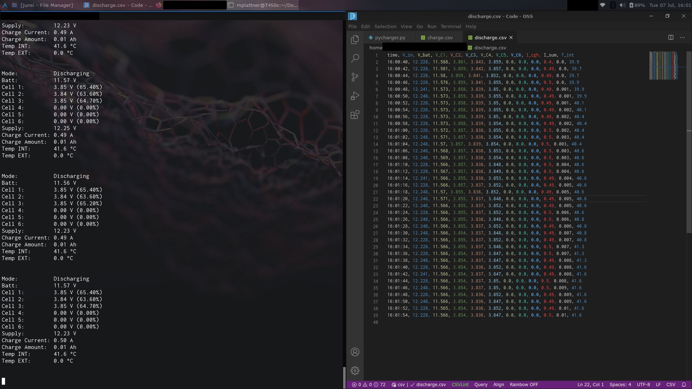

# Junsi iCharger pylogger

This is a python 3.x script intended to allow logging data collected by a junsic iCharger series device (only tested on 106b+!) to a computer.

Simply launch the script using `python pylogger.py` (depending on your system configuration, `python3` or `python3.x` might be needed) after connecting the charger. It will then periodically output the current device status, next to all measurments, into the console and if the device status is either 'charging' or 'discharging', it will log data in a separate .csv file per operation.

## Caveats
If you stop and restart the script, all previously recorded data will be overwritten - consider copying data you want to keep out of the directory as soon as the script is stopped.

The serial device (default: `/dev/ttyUSB0`) might need adjusting to your local setup - try running a dmesg after plugging the charger into the PCs USB port to see what device name it gets.

You have to adjust the array values in lines 68, 69 and 70 if your charger has more than 6 cell capability. Let's say it has 10, increase the 3 values in square brackets by 4 (new entries are 18, 16 and 17 respectively). Also, you have to add additional variables and entries in all print functions if you need readouts from those cells. I may try to automate this sometime, but manual setup has to do for now. Also, I can not test the script for any other amount of cells since I do not have access to larger junsi models.

## Dependencies
The script needs `pyserial`to be installed in order to work - please install it according to your operating system.

## Thanks to
The script is heavily based on the code published by user chrono on the following page: https://apollo.open-resource.org/mission:log:2012:10:06:free-and-open-source-junsi-icharger-data-logger
It has been updated to work with python 3.x and gained some additional features, as well as adjusted for the smaller charger I own.